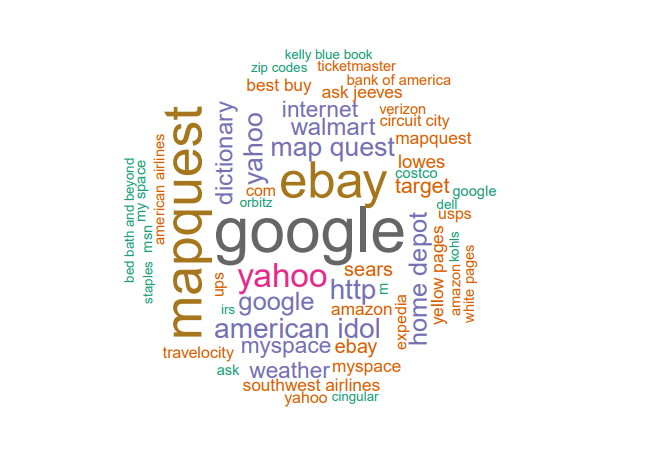
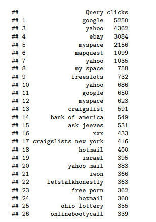
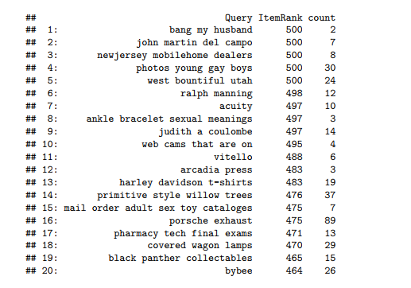
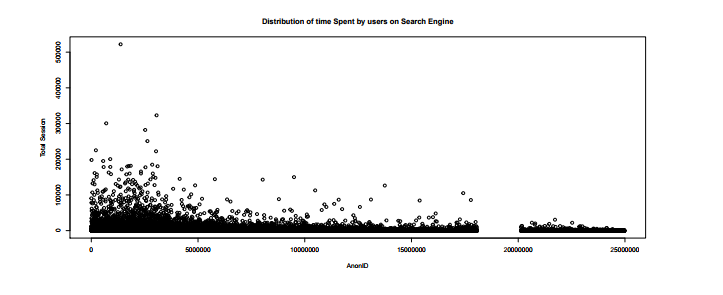
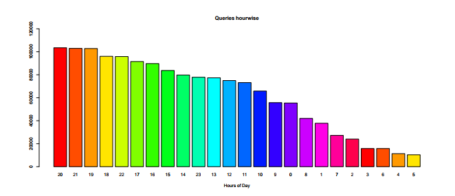
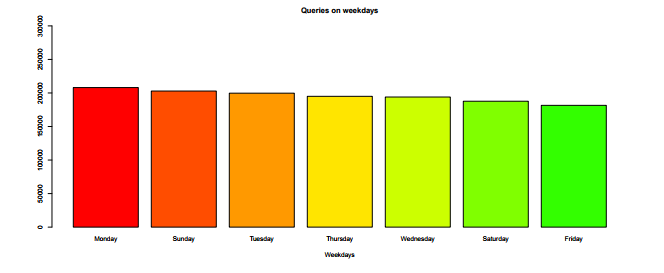
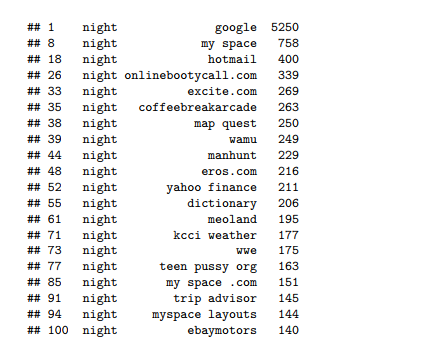

# EDA of AOL Search Query Logs

# About Dataset:
500k User Session Collection

The data set includes {AnonID, Query, QueryTime, ItemRank, ClickURL}
AnonID - an anonymous user ID number.
Query  - the query issued by the user, case shifted with most punctuation removed.
QueryTime - the time at which the query was submitted for search.
ItemRank  - if the user clicked on a search result, the rank of the item on which they clicked is listed. 
ClickURL  - if the user clicked on a search result, the domain portion of the URL in the clicked result is listed.

Each line in the data represents one of two types of events:
1. A query that was NOT followed by the user clicking on a result item.
2. A click through on an item in the result list returned from a query.

In the first case (query only) there is data in only the first three columns/fields -- namely AnonID, Query, and QueryTime (see above). 
In the second case (click through), there is data in all five columns.  For click through events, the query that preceded the click through is included.  Note that if a user clicked on more than one result in the list returned from a single query, there will be TWO lines in the data to represent the two events.  Also note that if the user requested the next "page" or results for some query, this appears as a subsequent identical query with a later time stamp.

### Problem Statements
#### a. Extract relevant metrics, create visualizations, and share a few (2 to 3) insights that you find interesting.

- Summary Statistics
   - Total no. of Queries : 3537372
   - Instances of New Queries / Unique queries in the log :  1219923
   - Total Unique Users :  61592
   - Query_per_user : 19.80652 (a user fires at least 19 queries in the log)
   - Next Page Requests :  589345
   - Total Unique URLS Count: 379146 
   - click_through_events : 1902838
   - Queries w/o click through:Those queries on which users has not taken any action
   - Unique Dates in Log data : 1634534
   - Minimum queries in a day : 4330
   - Maximumn queries in a day : 51990

* Missing Data: 

> We observe that on 2006-02-28 & 2006-05-17 only 4330 & 4411 (very few) queries were fired respectively on search engine
which indicates may be some technical reason that data is not logged which is unusual as per usual behavior
of users or may be servers were down which resulted in not logging of data while users were browsing

#### Detection of Outliers
• Outliers and robots sessions were removed before analysis
• Outliers are long term user sessions containing too many queries which were probably generated by
robots .So, Removing user sessions with highest no. of queries (top~1000)

> 361455 such records are robots or identified as outliers.

#### b. What do you want to share with the Product Manager of Search based on exploratory analysis of this dataset?
- People who come to browse on AOL search engines are looking for other search engines like google,yahoo
& msn.
- spell correction feature should be added since 72% of words are incorrectly spelled by a users in queries
that leads to a no click in collection of active users in 93 days.
- There are more Porn searches observed at night and shopping searches in afternoon.
- 81% of users are active in evening while 40% of users are active in morning and afternoon. So, evening
is the best time to target users for ad.
- At 7,8 and 10 in the evening most queries are fired, so the best time to show sponsored links which
would definitely results in conversion.
- Sunday and Monday are the best days in week to target users effectively.
- Looking at top urls we can say that users usually have an intent to ask questions when they come
online since they are broesing in ask, answers.
19
- Product manager should approach amazon for campaigns since it is the second top url searched on
search engine by users.
- Queries having a word count of less than or equal to 5 almost always converts to a click

#### c. What are some common queries ?
   

#### d. Which queries do not typically lead to a click ?
   

- More than 72 percent of the words are incorrectly spelled that leads to no click
- This implies product manager needs to deploy a spell correction feature on AOL for more clicks

#### e. Which queries almost always lead to a click ?
   
   
   - A Query of words having a count of 5 almost always convert to a click
   > 
      
#### f. Which queries do not seem to have relevant results ? You should define this in your own terms and back it up with data.
- Relevance of Search Queries
 > Queries that do not seem to have relevant results must be having an higher item rank since users has to
navigate to next page, which results in increase in item rank. 

Maximum Item Rank is 500 which implies user browsed 500 next pages against a query

   
   
 - More than 72 percent of the words are incorrectly spelled that leads to no click. 
 - This implies product manager needs to deploy a spell correction feature on AOL for more clicks. 
   
#### Relevance of Queries can be measured using following metrics
 - Stickiness of users on websites will indicate relevance of search queries
 -  Session length is seen as a more accurate alternative to measuring page views
 - Sessions per user can be used as a measurement of website usage
 
 *Defining Session : more than 30 minutes between events is a new session *

 

This implies users browsing on AOL search engine look for other search engines and spend a lot of time on
other search engines like google,yahoo and msn. So, AOL search engines is not performing well.

#### g. typical time spent by users on the search engine ? What does this distribution look like ?
   

#### h. What are the top urls that show up in results ?
   

*Interesting Insights*

#### Queries By Hours of Day
   

#### Queries By Weekdays
   
*Summarizing Queries requested at Period of day
Segmenting hours of day into different periods
0-7 <- Night 
7-10 <- morning
10-12 <- Noon 
12-17 <-Afternoon 
17-23 <- Evening:*

#### Types of Queries made by Active users around Afternoon
   

It shows more of a shopping trend of users in afternoon going to sites like ebay,walmart,amazon

#### Types of Queries made by Active users at Night
   

More Porn searches were seen at night

